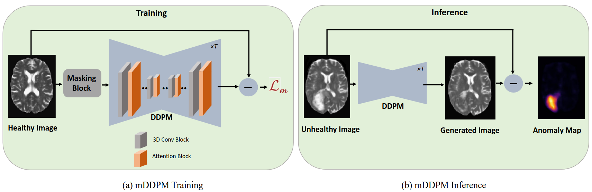
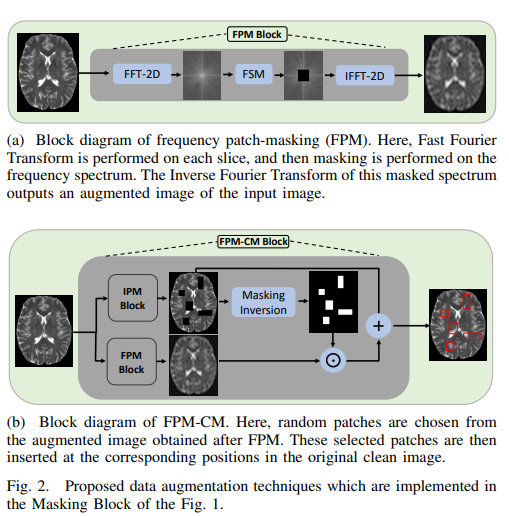

# mDDPM
See our work at: [mddpm.github.io](https://mddpm.github.io)

Codebase for the paper [Unsupervised Anomaly Detection in Medical Images Using Masked Diffusion Model](https://arxiv.org/abs/2305.19867)
<h5 align="center">

 

</h5>
## Graphical abstract

## Data
For our experiments, we make use of the MSLUB, BraTS21, and IXI data sets. 
You can request or download the data sets here:

* IXI: https://brain-development.org/ixi-dataset/
* BraTS21: http://braintumorsegmentation.org/
* MSLUB: https://lit.fe.uni-lj.si/en/research/resources/3D-MR-MS/

## Data Preprocessing
The downloaded zip files must be extracted and organized as follows before processing: 

    ├── IXI
    │   ├── t2 
    │   │   ├── IXI1.nii.gz
    │   │   ├── IXI2.nii.gz
    │   │   └── ... 
    │   └── ...
    ├── MSLUB
    │   ├── t2 
    │   │   ├── MSLUB1.nii.gz
    │   │   ├── MSLUB2.nii.gz
    │   │   └── ...
    │   ├── seg
    │   │   ├── MSLUB1_seg.nii.gz
    │   │   ├── MSLUB2_seg.nii.gz
    │   │   └── ...
    │   └── ...
    ├── Brats21
    │   ├── t2 
    │   │   ├── Brats1.nii.gz
    │   │   ├── Brats2.nii.gz
    │   │   └── ...
    │   ├── seg
    │   │   ├── Brats1_seg.nii.gz
    │   │   ├── Brats2_seg.nii.gz
    │   │   └── ...
    │   └── ...
    └── ...

We preprocess the data by resampling it to 1.0 mm, skull-stripping with HD-BET, registering it to the SRI Atlas, removing the black boarders, and correcting for N4 bias. 
You must clone and set up the [HD-BET](https://github.com/MIC-DKFZ/HD-BET) tool for skull-stripping in order to conduct the preprocessing.
The preprocessing is carried out via a separate bash script for each data set in the [preprocessing](preprocessing) directory. Go to the [preprocessing](preprocessing) directory to preprocess the data:

    cd preprocessing

execute the bash script:

    bash prepare_IXI.sh <input_dir> <output_dir>
The directory in which the downloaded, raw data is kept is referred to as the "input_dir".

Note, that the skull-stripping portion of this script will use a GPU, and you must give absolute paths.

Example for the IXI data set:

    bash prepare_IXI.sh /raw_data/IXI/ $(pwd)

The outcomes of the intermediate preprocessing stages will be organized into 4 distinct folders as a result. /processed_data/v4correctedN4_non_iso_cut contains the final scans and consequently used as inputs for mDDPM.

Place the data (the folder v4correctedN4_non_iso_cut) in your DATA_DIR after preprocessing.

    cp -r <output_dir>/IXI <DATA_DIR>/Train/ixi
    cp -r <output_dir>/MSLUB <DATA_DIR>/Test/MSLUB
    cp -r <output_dir>/Brats21 <DATA_DIR>/Test/Brats21
The directory structure of <DATA_DIR> should look like this: 

    <DATA_DIR>
    ├── Train
    │   ├── ixi
    │   │   ├── mask
    │   │   ├── t2
    ├── Test
    │   ├── Brats21
    │   │   ├── mask
    │   │   ├── t2
    │   │   ├── seg
    │   ├── MSLUB
    │   │   ├── mask
    │   │   ├── t2
    │   │   ├── seg
    ├── splits
    │   ├──  Brats21_test.csv
    │   ├──  Brats21_val.csv
    │   ├──  MSLUB_val.csv 
    │   ├──  MSLUB_test.csv
    │   ├──  IXI_train_fold0.csv
    │   ├──  IXI_train_fold1.csv 
    │   └── ...
    └── ...

You should then specify the path the location of <DATA_DIR> in the pc_environment.env file. Additionally, specify the <LOG_DIR>.

## Environment Set-up
To download the code type 

    git clone https://github.com/hasan1292/mDDPM.git

In your linux terminal and switch directories via

    cd mDDPM

To setup the environment with all required packages and libraries, you need to install anaconda first. 

Then, run 

    conda env create -f environment.yml -n mDDPM

and subsequently run 

    conda activate mDDPM
    pip install -r requirements.txt

to install all required packages.

## Run Experiments

Execute the following command to begin the pDDPM's training and evaluation: 

    python run.py experiment=mDDPM/mDDPM

To execute the experiment, you must have an NVIDIA GPU with at least 16GB of RAM. 

## Acknowledgement

This code base is inspired and built-upon from [pddpm-uad](https://github.com/FinnBehrendt/patched-Diffusion-Models-UAD)

## Citation
If you plan to use our work, please cite it as follows:

@misc{iqbal2023unsupervised,
      title={Unsupervised Anomaly Detection in Medical Images Using Masked Diffusion Model}, 
      author={Hasan Iqbal and Umar Khalid and Jing Hua and Chen Chen},
      year={2023},
      eprint={2305.19867},
      archivePrefix={arXiv},
      primaryClass={eess.IV}
}
